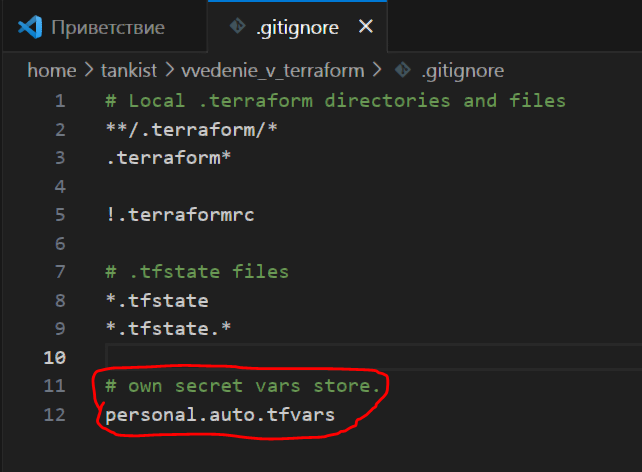
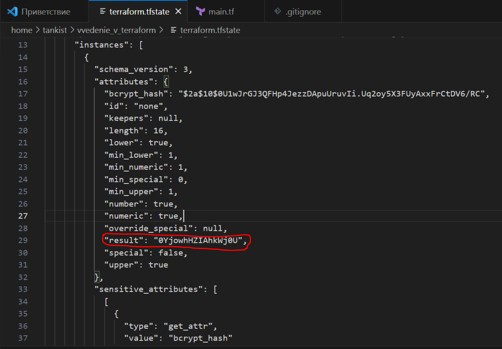
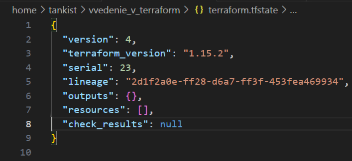
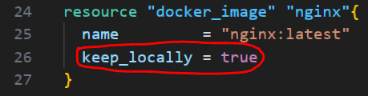

# Домашнее задание к занятию «Введение в Terraform»
Из - за того, что компания Хашикорп по отношению к России откровенно враждебную позицию, а адекватного отечественного аналога Терраформа не существует, возникли серьёзные технические сложности особенно с взаимодействием с облачными провайдерами, поэтому большая часть ответов в виде кода.</br>
Подробное описание выполнения данных процессов [здесь](/%D0%9F%D0%BE%D0%B4%D0%B3%D0%BE%D1%82%D0%BE%D0%B2%D0%BA%D0%B0.md).

## Задание 1

Скачал каталог [src](https://github.com/netology-code/ter-homeworks/tree/main/01/src) в котором находится исходная версия файла main.tf</br>
Проводим инициализацию:</br>
```
tankist@docker-vm:~/vvedenie_v_terraform$ terraform init
Initializing provider plugins found in the configuration...
- Finding kreuzwerker/docker versions matching "4.2.0"...
- Finding latest version of hashicorp/random...
- Installing kreuzwerker/docker v4.2.0...
- Installed kreuzwerker/docker v4.2.0 (unauthenticated)
- Installing hashicorp/random v3.8.1...
- Installed hashicorp/random v3.8.1 (unauthenticated)
Initializing the backend...
Terraform has created a lock file .terraform.lock.hcl to record the provider
selections it made above. Include this file in your version control repository
so that Terraform can guarantee to make the same selections by default when
you run "terraform init" in the future.
╷
│ Warning: Incomplete lock file information for providers
│ Due to your customized provider installation methods, Terraform was forced to calculate lock file checksums
│ locally for the following providers:
│   - hashicorp/random
│   - kreuzwerker/docker
│ The current .terraform.lock.hcl file only includes checksums for linux_amd64, so Terraform running on another
│ platform will fail to install these providers.
│ To calculate additional checksums for another platform, run:
│   terraform providers lock -platform=linux_amd64
│ (where linux_amd64 is the platform to generate)
╵
Terraform has been successfully initialized!
You may now begin working with Terraform. Try running "terraform plan" to see
any changes that are required for your infrastructure. All Terraform commands
should now work.
If you ever set or change modules or backend configuration for Terraform,
rerun this command to reinitialize your working directory. If you forget, other
commands will detect it and remind you to do so if necessary.
```
Согласно файлу .gitignore в файле терраформ personal.auto.tfvars допускается хранить секретные данные.

</br>
Рисунок 1.1. Файл .gitignore</br>
После команды terraform apply получаем секретное значение random_password, оно лежит в файлике terraform.tfstate

</br>
Рисунок 1.2. Секретное значение в файле .tfstate</br>
После раскомментирования закомментированной части main.tf получаем ошибки в строках 24 (не указан тип ресурса для docker_image, ведь должно быть два значения) и 29 (цифра в названии, а так быть не должно, либо буква, либо нижнее подчеркивание):
```
tankist@docker-vm:~/vvedenie_v_terraform$ terraform validate
╷
│ Error: Missing name for resource
│ 
│   on main.tf line 24, in resource "docker_image":
│   24: resource "docker_image" {│ 
│ All resource blocks must have 2 labels (type, name).
╵
╷
│ Error: Invalid resource name 
│   on main.tf line 29, in resource "docker_container" "1nginx":
│   29: resource "docker_container" "1nginx" { 
│ A name must start with a letter or underscore and may contain only letters, digits, underscores, and dashes.
```
После их исправлений обнаруживается ошибка в строке 31 (название ресурса задано random_string, а там random_string_FAKE и еще resulT написан через большие буквы):
```
tankist@docker-vm:~/vvedenie_v_terraform$ terraform validate
╷
│ Error: Reference to undeclared resource 
│   on main.tf line 31, in resource "docker_container" "nginx":
│   31:   name  = "example_${random_password.random_string_FAKE.resulT}"
│ A managed resource "random_password" "random_string_FAKE" has not been declared in the root module.
```
Исправляем её, после чего валидация проходит успешно:
```
tankist@docker-vm:~/vvedenie_v_terraform$ terraform validate
Success! The configuration is valid.
```
После команд terraform plan и terraform apply смотрим процессы Докера:
```
tankist@docker-vm:~/vvedenie_v_terraform$ docker ps
CONTAINER ID   IMAGE          COMMAND                  CREATED         STATUS         PORTS                  NAMES
884c24c0be56   a7a9f7e9f549   "/docker-entrypoint.…"   5 minutes ago   Up 5 minutes   0.0.0.0:9090->80/tcp   example_B9eYXMQqBMILZ5Ij
```
Меняем имя контейнера на новое и применяем команду terraform apply -auto-approve и видим, что имя конетйнера у нас поменялось без нашего подтверждения:
```
tankist@docker-vm:~/vvedenie_v_terraform$ docker ps
CONTAINER ID   IMAGE          COMMAND                  CREATED          STATUS          PORTS                  NAMES
34e5c53634ab   a7a9f7e9f549   "/docker-entrypoint.…"   57 seconds ago   Up 56 seconds   0.0.0.0:9090->80/tcp   hello_world
```
Ключ auto-approve автоматичсеки применяет новое описание в манифестах к существующей конфигурации без потверждения. На практике такое лучше использовать либо в тестовых средах, либо во всяких CI/CD для автоматического аппрува изменения конфигурации.</br>
Уничтожаем инфраструктуру командой terraform destroy:
```
tankist@docker-vm:~/vvedenie_v_terraform$ terraform destroy
docker_image.nginx: Refreshing state... [id=sha256:a7a9f7e9f549699206cd61c9d14c5434c7ed85e510e837211e0c2d24c9bdb9acnginx:latest]
random_password.random_string: Refreshing state... [id=none]
docker_container.nginx: Refreshing state... [id=34e5c53634ab5acdb9f3b7c10264b04ec1956af7805af210aec9316b7577627c]
Terraform used the selected providers to generate the following execution plan. Resource actions are indicated with the following
symbols:
  - destroy
Terraform will perform the following actions:
  # docker_container.nginx will be destroyed
  - resource "docker_container" "nginx" {
      - attach                                      = false -> null
      - command                                     = [
          - "nginx",
          - "-g",
          - "daemon off;",
        ] -> null
      - container_read_refresh_timeout_milliseconds = 15000 -> null
      - cpu_shares                                  = 0 -> null
      - dns                                         = [] -> null
      - dns_opts                                    = [] -> null
      - dns_search                                  = [] -> null
      - entrypoint                                  = [
          - "/docker-entrypoint.sh",
        ] -> null
      - env                                         = [] -> null
      - group_add                                   = [] -> null
      - hostname                                    = "34e5c53634ab" -> null
      - id                                          = "34e5c53634ab5acdb9f3b7c10264b04ec1956af7805af210aec9316b7577627c" -> null
      - image                                       = "sha256:a7a9f7e9f549699206cd61c9d14c5434c7ed85e510e837211e0c2d24c9bdb9ac" -> null
      - init                                        = false -> null
      - ipc_mode                                    = "private" -> null
      - log_driver                                  = "json-file" -> null
      - log_opts                                    = {} -> null
      - logs                                        = false -> null
      - max_retry_count                             = 0 -> null
      - memory                                      = 0 -> null
      - memory_reservation                          = 0 -> null
      - memory_swap                                 = 0 -> null
      - must_run                                    = true -> null
      - name                                        = "hello_world" -> null
      - network_data                                = [
          - {
              - gateway                   = "172.17.0.1"
              - global_ipv6_prefix_length = 0
              - ip_address                = "172.17.0.2"
              - ip_prefix_length          = 16
              - mac_address               = "52:a6:b9:86:b0:15"
              - network_name              = "bridge"
                # (2 unchanged attributes hidden)
            },
        ] -> null
      - network_mode                                = "bridge" -> null
      - platform                                    = "linux" -> null
      - privileged                                  = false -> null
      - publish_all_ports                           = false -> null
      - read_only                                   = false -> null
      - remove_volumes                              = true -> null
      - restart                                     = "no" -> null
      - rm                                          = false -> null
      - runtime                                     = "runc" -> null
      - security_opts                               = [] -> null
      - shm_size                                    = 64 -> null
      - start                                       = true -> null
      - stdin_open                                  = false -> null
      - stop_signal                                 = "SIGQUIT" -> null
      - stop_timeout                                = 0 -> null
      - storage_opts                                = {} -> null
      - sysctls                                     = {} -> null
      - tmpfs                                       = {} -> null
      - tty                                         = false -> null
      - wait                                        = false -> null
      - wait_timeout                                = 60 -> null
        # (7 unchanged attributes hidden)
      - ports {
          - external = 9090 -> null
          - internal = 80 -> null
          - ip       = "0.0.0.0" -> null
          - protocol = "tcp" -> null
        }
    }
  # docker_image.nginx will be destroyed
  - resource "docker_image" "nginx" {
      - id           = "sha256:a7a9f7e9f549699206cd61c9d14c5434c7ed85e510e837211e0c2d24c9bdb9acnginx:latest" -> null
      - image_id     = "sha256:a7a9f7e9f549699206cd61c9d14c5434c7ed85e510e837211e0c2d24c9bdb9ac" -> null
      - keep_locally = true -> null
      - name         = "nginx:latest" -> null
      - repo_digest  = "nginx@sha256:a7a9f7e9f549699206cd61c9d14c5434c7ed85e510e837211e0c2d24c9bdb9ac" -> null
    }
  # random_password.random_string will be destroyed
  - resource "random_password" "random_string" {
      - bcrypt_hash = (sensitive value) -> null
      - id          = "none" -> null
      - length      = 16 -> null
      - lower       = true -> null
      - min_lower   = 1 -> null
      - min_numeric = 1 -> null
      - min_special = 0 -> null
      - min_upper   = 1 -> null
      - number      = true -> null
      - numeric     = true -> null
      - result      = (sensitive value) -> null
      - special     = false -> null
      - upper       = true -> null
    }
Plan: 0 to add, 0 to change, 3 to destroy.
Do you really want to destroy all resources?
  Terraform will destroy all your managed infrastructure, as shown above.
  There is no undo. Only 'yes' will be accepted to confirm.
  Enter a value: yes
random_password.random_string: Destroying... [id=none]
random_password.random_string: Destruction complete after 0s
docker_container.nginx: Destroying... [id=34e5c53634ab5acdb9f3b7c10264b04ec1956af7805af210aec9316b7577627c]
docker_container.nginx: Destruction complete after 1s
docker_image.nginx: Destroying... [id=sha256:a7a9f7e9f549699206cd61c9d14c5434c7ed85e510e837211e0c2d24c9bdb9acnginx:latest]
docker_image.nginx: Destruction complete after 0s
Destroy complete! Resources: 3 destroyed.
```
После уничтожения инфраструктуры файл .tfstate изменился:

</br>
Рисунок 1.3. Файл .tfstate после уничтожения инфраструктуры.</br>
Докер образ nginx:lates не был удален, потому что потому что использовали параметр keep_locally = true при создании image.

</br>
Рисунок 1.4. Параметр keep_locally = true.
```
tankist@docker-vm:~/vvedenie_v_terraform$ docker image ls                                                                                                                                              i Info →   U  In Use
IMAGE                        ID             DISK USAGE   CONTENT SIZE   EXTRA
hashicorp/terraform:latest   c89ed543266c        198MB         50.4MB        
nginx:latest                 a7a9f7e9f549        240MB         65.8MB
```
[Параметр keep_locally является логическим и может принимать два значения -  true и false. Если значение true, то Docker образ не будет удалён при операции destroy. Если значение false, то образ будет удалён из локального хранилища docker при операции destroy](https://docs.comcloud.xyz/providers/kreuzwerker/docker/latest/docs/resources/image).</br>
Файлы терраформ проекта после выполнения данного задания находятся [здесь](files/vvedenie_v_terraform/).
